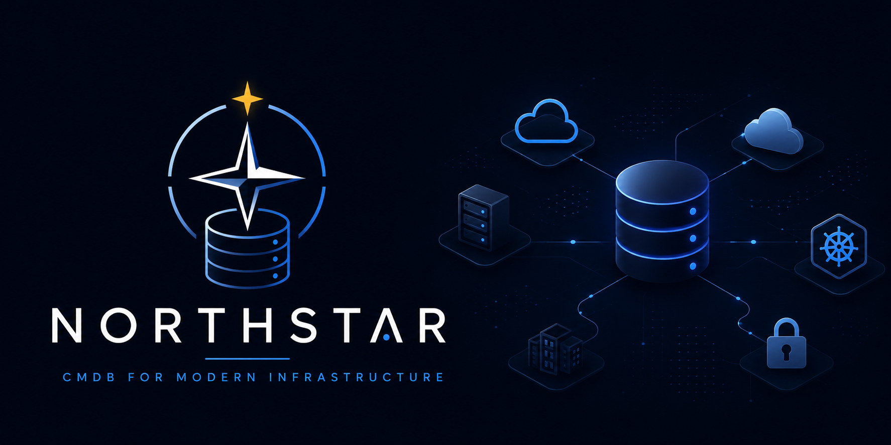

# 🌟 Northstar



**Northstar** is a modern, high-performance Configuration Management Database (CMDB) platform developed by **Astrona** (astrona.io). It features a polished Nuxt 3 frontend and a highly optimized, relational **Golang (Echo + GORM + SQLite)** backend.

---

## 📋 Prerequisites

Before starting, ensure you have the following installed on your system:
- **Golang 1.20+**
- **Node.js 24+ & npm**

---

## 🛠️ Initial Setup (Run Once)

You only need to run these steps the very first time you set up the project.

**1. Set up the Backend**
```bash
cd backend
go mod download
cd ..
```

**2. Set up the Frontend**
```bash
cd frontend
npm install
cd ..
```

---

## 🚀 Running the Application (The Easy Way)

We have included a startup script to run both the frontend and backend servers simultaneously!

**1. Make the script executable (only needed once):**
```bash
chmod +x start.sh
```

**2. Start both servers:**
```bash
./start.sh
```

**3. Access your application:**
- **Frontend Dashboard:** [http://localhost:3000](http://localhost:3000)
- **Backend API:** [http://localhost:8000/api](http://localhost:8000/api)

**To Stop:** Simply press `Ctrl+C` in the terminal where the script is running. It will gracefully shut down both servers.

---

## ⚡ Simplified Unified Commands (`just`)

If you have [just](https://github.com/casey/just) installed on your system, you can use these simple, intuitive shortcuts directly from the project root:

### Running Servers
* **Start Backend Server:** `just backend` (Runs Go REST API on port `8000`)
* **Start Frontend Dashboard:** `just frontend` (Runs Nuxt 3 dev server on port `3000`)

### Running Tests
* **Backend Unit & Integration Tests:** `just test-backend` (Go tests)
* **Frontend Component Unit Tests:** `just test-frontend` (Vitest unit tests)
* **End-to-End E2E Browser Tests:** `just test-e2e` (Playwright tests on a real E2E database)

### Developer Documentation (MkDocs)
* **Setup Documentation Packages:** `just docs-setup` (Installs MkDocs Material)
* **Start Documentation Live Preview:** `just docs-serve` (Starts hot-reloading server on port `8000`)
* **Build Documentation Site:** `just docs-build` (Compiles optimized HTML static files)

---

## 💻 Manual Execution (Separate Terminals)

If you prefer to run them in separate terminal windows (useful for debugging):

**Terminal 1 (Backend - Go):**
```bash
cd backend
go run cmd/server/main.go
```

**Terminal 2 (Frontend - Nuxt 3):**
```bash
cd frontend
npm run dev
```

---

## 🧪 Testing Suite

We have added robust test coverage spanning unit, integration, and E2E UX tests across the stack.

### 1. Backend Tests (Go)
Run unit and integration tests (including the handler CRUD and schema validation checks) using Go's built-in testing tool:
```bash
cd backend
go test -v ./...
```

### 2. Frontend Unit Tests (Vitest)
Verify frontend components, dynamic property rendering, and form behaviors:
```bash
cd frontend
npm run test     # runs vitest run
```

### 3. Frontend E2E & UX Tests (Playwright)
Run Playwright end-to-end integration tests that spin up the server and simulate browser operations to test user flows (like modal popups, homepage loads, cancel-close behaviors, etc.):
```bash
cd frontend
npx playwright test
```
To open the last HTML test report generated:
```bash
cd frontend
npx playwright show-report
```

---

## 📖 Developer Documentation (MkDocs)

We maintain high-fidelity, Diátaxis-conforming developer documentation built using **MkDocs** and the **Material for MkDocs** theme.

### Run the Documentation Preview Locally

1. **Install Prerequisites:** Ensure you have Python installed, then install MkDocs Material:
   ```bash
   pip install mkdocs-material
   ```
2. **Start Hot-Reloading Server:** Launch the local development preview server:
   ```bash
   mkdocs serve
   ```
3. **Access Documentation:** Open your browser and navigate to **`http://127.0.0.1:8000`**. Any edits made to files inside the `docs/` folder will hot-reload instantly!

### Build Documentation for Production
Compile the markdown source files into a static, optimized HTML production build inside the `site/` folder:
```bash
mkdocs build
```

---

## 🌟 Tech Stack & Features
- **Frontend:** Nuxt 3 (Vue 3, Vue Router), Nuxt UI, Tailwind CSS, Dark/Light Mode.
- **Backend:** Go (Golang), Echo HTTP Framework, GORM v2, SQLite (In-Memory for tests).
- **Observability:** Custom composables for unified API fetching and clean decoupling.
- **Validation:** Go-based type-specific JSON schema validations (`properties_schema.go`) enforcing database metadata integrity.
