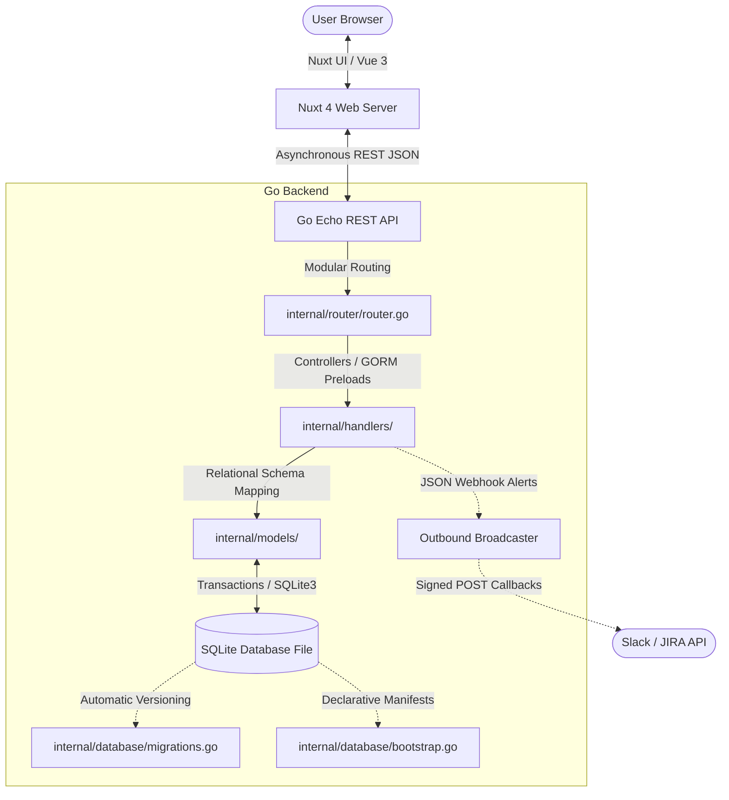
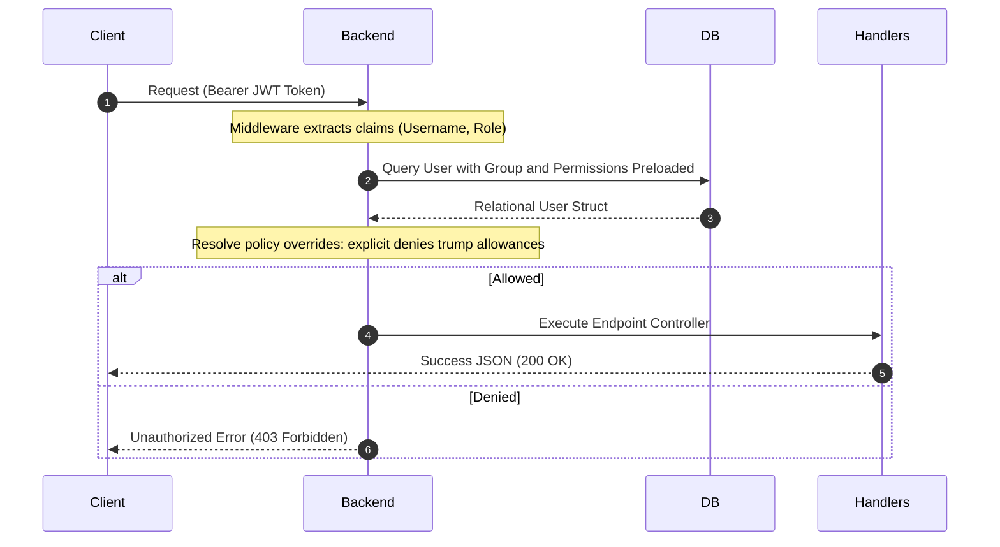

# System Architecture & Technical Deep-Dive

This document provides a comprehensive technical overview of Northstar's underlying systems architecture, detailing the JWT-RBAC policy weights model, the YAML GitOps bootstrap engine, and the modular REST router topology.

---

## 🏗️ Core Architecture Overview

Northstar is structured as a decoupled, full-stack client-server application optimized for extreme reliability, fast startup cycles, and minimal metadata transaction latency.

---

## 🔐 Advanced Role-Based Access Control (RBAC)

Northstar enforces a relational, weighted permission-policy model securely parsed over JWT authentication headers. It stands out by resolving hierarchical policy overrides between **Access Groups** and **User Overrides**:

1. **Access Group Policy Weights:**
   Users can belong to a Group (such as the `Operations Group` which allows the `asset:write` policy).
2. **User Explicit Overrides:**
   Users can be directly linked to individual explicit permissions. If a User has a permission linked with a `deny` effect (such as `catalog:write` marked with `deny`), GORM's policy weighted resolver will automatically prioritize the explicit user denial, overriding any broad group allowance.

The authorization handshake operates statelessly via GORM checks inside the Echo REST middleware:

---

## 🚀 YAML Bootstrapping & GitOps Reconciliation

To support standard DevSecOps practices, Northstar integrates a declarative **GitOps Bootstrapping Engine** that runs automatically on every server cold start:

* **Directory Auditing:** On boot, the seeder walks `.northstar-data/bootstrap/` recursively.
* **YAML Ingestion:** The seeder parses modular single-resource manifests matching the `network.northstar.astrona.io/v1alpha1` Kubernetes API specifications.
* **GORM Reconciliation:** Utilizing GORM's `FirstOrCreate` transaction boundaries, the system reconciles existing categories, sub-groups, users, and groups, updating metadata attributes dynamically without resetting active relational IDs or triggering GORM integrity warnings.
